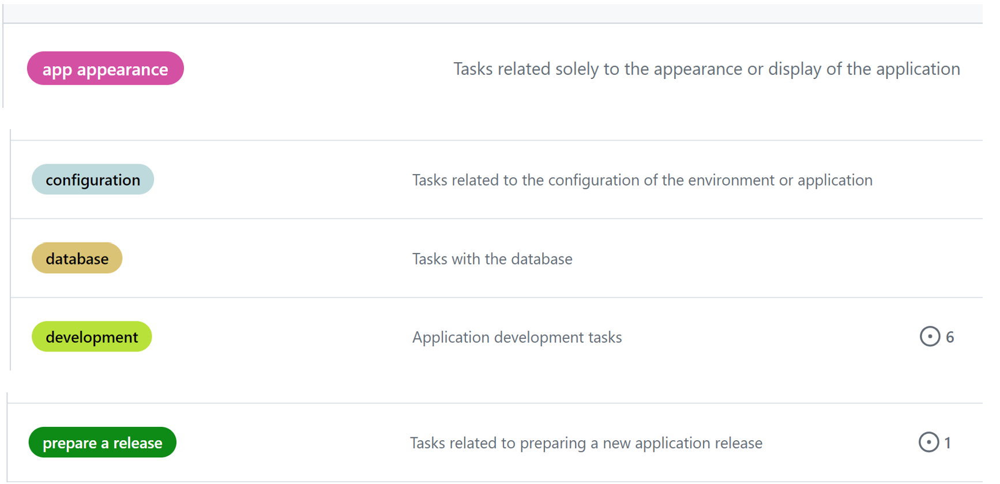
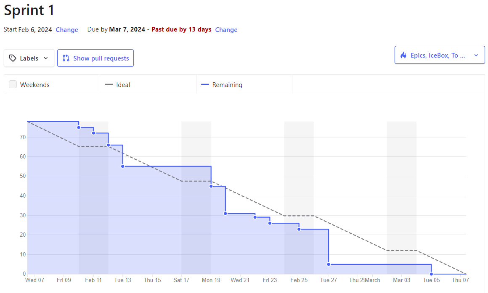
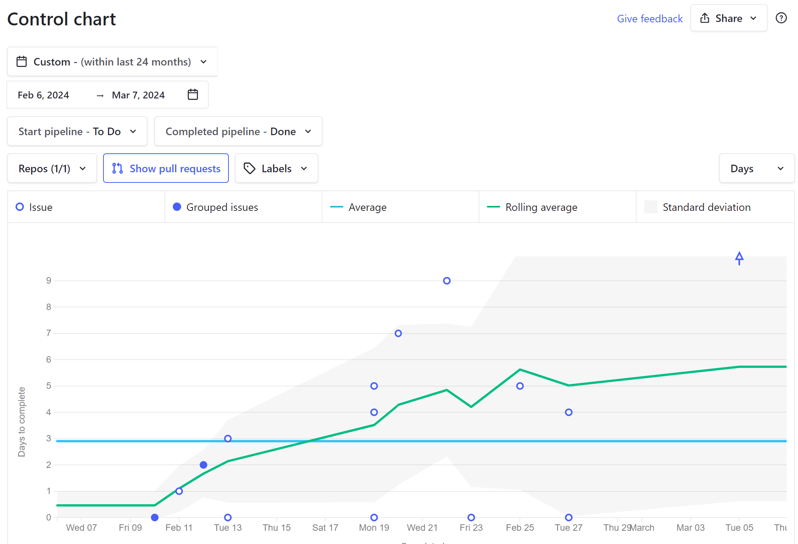
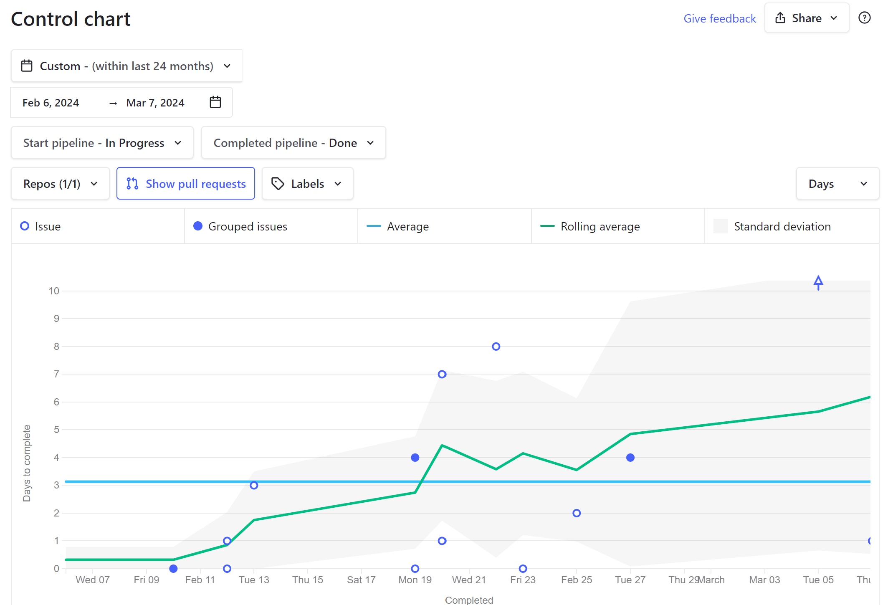
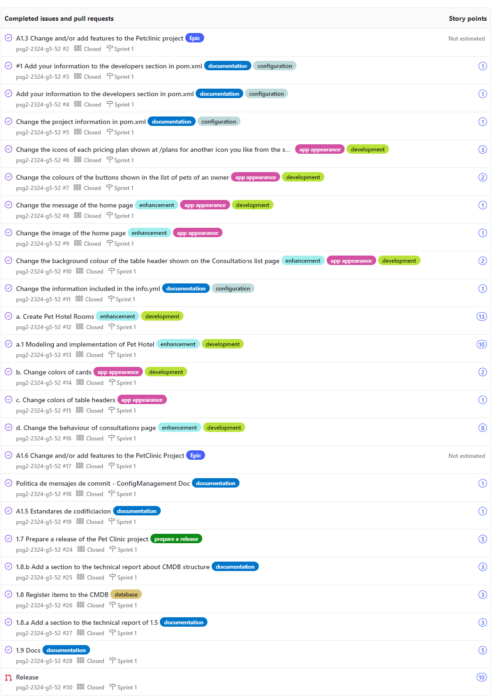
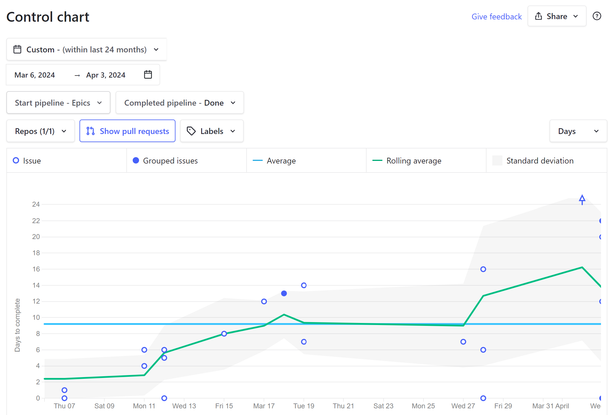
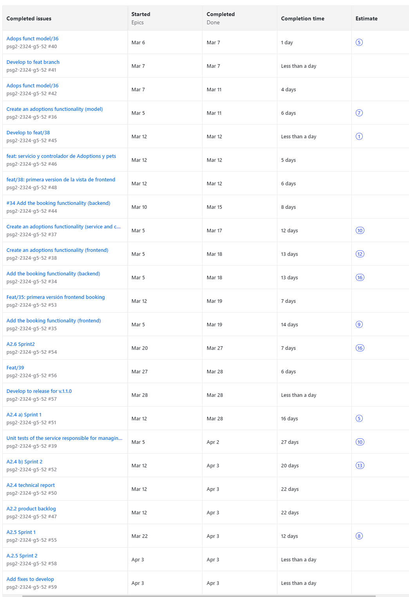
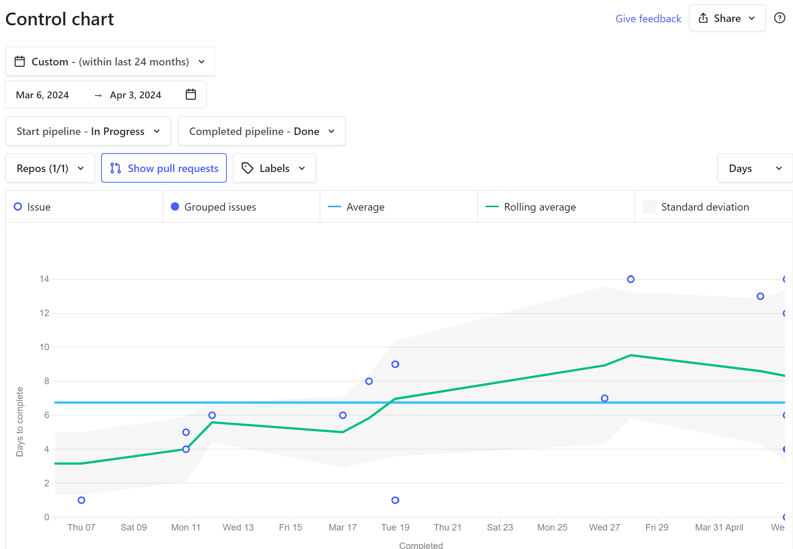
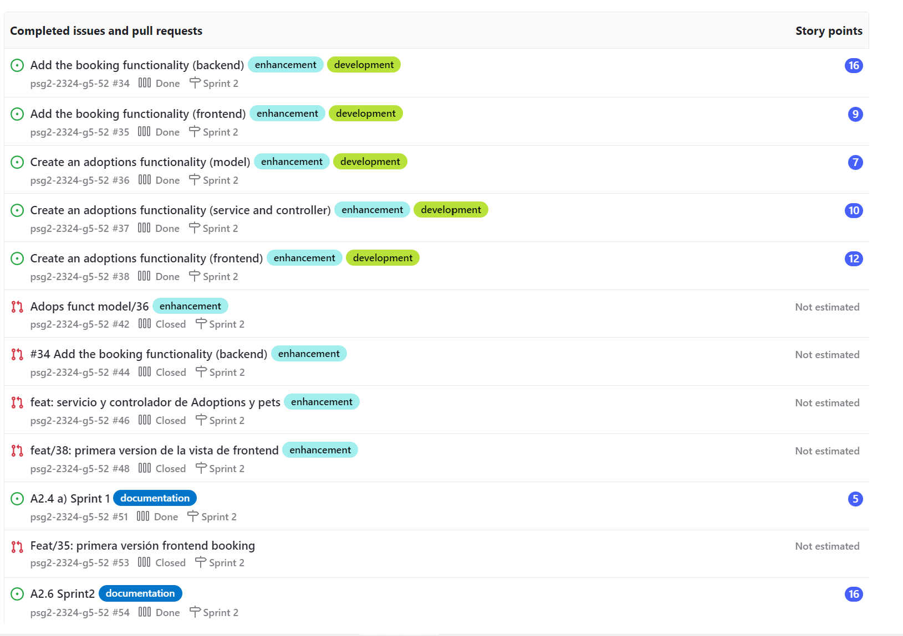

# Métricas de Proceso Ágil y Recursos

# Universidad de Sevilla   

## Escuela Técnica Superior de Ingeniería Informática

### **Grupo de Prácticas G5-52**
  
  

### Grado en Ingeniería Informática – Ingeniería del Software 

### Proceso Software y Gestión II
### Product Owner: Carlos Guillermo Müller Cejas
### Curso 2023 – 2024

### Miembros del equipo
- Benjamín Ignacio Maureira Flores
- David Godoy Fernández
- Miguel Hernández Sánchez
- Rafael David Caro Medina
- Ramón José Guerrero Romero

# Indice
  - [Introducción](#introducción)
  - [Métricas para el Sprint 1](#métricas-para-el-sprint-1)
    - [Gráfico Burn Down](#gráfico-burn-down)
      - [Análisis e intrepretación del gráfico](#análisis-e-intrepretación-del-gráfico)
    - [Gráfico de Control mostrando el Lead Time](#gráfico-de-control-mostrando-el-lead-time)
      - [Análisis e intrepretación del gráfico](#análisis-e-intrepretación-del-gráfico-1)
    - [Gráfico de Control mostrando el Cycle Time](#gráfico-de-control-mostrando-el-cycle-time)
      - [Análisis e intrepretación del gráfico](#análisis-e-intrepretación-del-gráfico-2)
    - [Total de puntos de historia entregados](#total-de-puntos-de-historia-entregados)
    - [Porcentaje de puntos de historia entregados](#porcentaje-de-puntos-de-historia-entregados)
  - [Métricas para el Sprint 2](#métricas-para-el-sprint-2)
    - [Gráfico Burn Down Sp2](#gráfico-burn-down-sp2)
      - [Análisis e intrepretación del gráfico](#análisis-e-intrepretación-del-gráfico-3)
    - [Gráfico de Control mostrando el Lead Time Sp2](#gráfico-de-control-mostrando-el-lead-time-sp2)
      - [Análisis e intrepretación del gráfico](#análisis-e-intrepretación-del-gráfico-4)
    - [Gráfico de Control mostrando el Cycle Time Sp2](#gráfico-de-control-mostrando-el-cycle-time-sp2)
      - [Análisis e intrepretación del gráfico](#análisis-e-intrepretación-del-gráfico-5)
    - [Total de puntos de historia entregados Sp2](#total-de-puntos-de-historia-entregados-sp2)
    - [Porcentaje de puntos de historia entregados Sp2](#porcentaje-de-puntos-de-historia-entregados-sp2)
    - [Calendario Niko-Niko para el Sprint 2](#calendario-niko-niko-para-el-sprint-2)
    - [Funcionamiento y objetivo](#funcionamiento-y-objetivo)
  - [Ejemplo de Plantilla](#ejemplo-de-plantilla)
    - [Plantilla de Medición del Sprint 2](#plantilla-de-medición-del-sprint-2)
      - [Análisis cualitativo y conclusiones del calendario Niko-Niko](#análisis-cualitativo-y-conclusiones-del-calendario-niko-niko)

___

## Introducción

En este informe técnico se describen las distintas métricas de proceso ágil, y recursos, medidos trás el desarrollo de los dos primeros Sprints del proyecto PetClinicApplication del Grupo G5-52.

Con el fin de poder afinar aún más, o definir mejor, la naturaleza del trabajo a realizar sobre cada una de las tareas creadas, y poder filtrar posteriormente por ellas para su análisis y estudio desde los distintos gráficos de ZenHub, hemos decidido crear cinco `Labels`, o etiquetas, personalizadas, y asignarlas tanto a las tareas que teníamos ya creadas para el sprint 1, como a las creadas para este segundo sprint.

Las cinco `Labels`, o etiquetas, personalizadas creadas han sido :

## Métricas para el Sprint 1

### **Gráfico Burn Down** 

A continuación se representa el gráfico Burn Down de tareas realizadas correspondiente al Sprint 1 del proyecto, entre las fechas 6/Feb/2024 al 7/Mar/2024, día final de la entrega, porque hasta ese día se estuvieron realizando tareas de última hora.

Se incluyen en el gráfico las `Pull Requests` generadas durante el sprint.

En teoría en la opción "Burns Pipelines" del informe habría que seleccionar únicamente el pipeline `Done`, donde deberían haber acabado todas las tareas, `Pull Request` y Épicas definidas durante el sprint, antes de pasar a `Closed` al finalizar la Sprint Review y trás la aceptación del Product Owner. 

Pero debido a algunos errores cometidos con el movimiento de tareas y Èpicas a lo largo del tablero de ZenHun, al menos 3 tareas, la #3 (1 punto de historia), la #13 (10 puntos de historia) y la #30 (10 puntos de historia), en total 21 puntos de historia, parecen no haberse movido nunca a `Done`, por lo que hay que seleccionar en "Burns Pipelines" el pipeline `ToDo`, y lo mismo parece ocurrir con una Épica, que no ha se ha movido a `Done` y por ello hay que incluir el pipeline `Epics`, para que aparezcan todas las tareas y puntos de historia correspondientes, a la fecha de finalización del sprint, y se contemplen como "Completados" en el gráfico.

De esta forma, y tras hablarlo con el Product Owner, hemos decidido incluir todos los pipelines de ZenHub en "Burns Pipelines", incluido `Epics`, con el fin de que la línea de puntos de historia completados finalice el martes 5 de Marzo con los 78 puntos de historia `Completados` y 0 `Pendientes`, y con 24 tareas y Pull Requests `Completadas` y 0 `Pendientes`, como ha ocurrido en realidad aunque las tareas no se hayan movido correctamente por el tablero de ZenHub.

Gráfico con TODOS los pipelines e incluyendo Pull Requests del Sprint 1.

#### Análisis e intrepretación del gráfico

Se observa cómo las primeras tareas completadas, al principio del sprint durante la primera semana, tuvieron una estimación pequeña, al tratarse de modificaciones sobre archivos de configuración del proyecto o bien modificaciones sobre iconos o colores de fondo en elementos de la aplicación, con lo cual, el progreso real estuvo por encima de la línea ideal estimada por GitHub.

En cambio durante la segunda semana se acometieron las tareas de desarrollo correspondientes a la funcionalidad Pet Hotel Rooms, junto a otras pequeñas, que sí provocó que la línea de progreso real y tareas completadas bajara por debajo de la línea ideal, para el día 19 de febrero, comienzo de la tercera semana del sprint. 

A partir de ese día se realizan una serie de pequeñas tareas de desarrollo y redacción del informe técnico de gestión de la configuración donde el progreso vuelve a descender lentamente, aunque se mantiene ya en todo momento por debajo de la línea ideal y con perspectiva de finalizar todas las tareas para el fin del sprint.

Finalmente para la última semana del sprint, sobre el día 27 de febreo, se finalizan las tareas de registrar los elementos de configuración en la CMDB, término de redacción del informe técnico con informaicón de la CMDB, y la tarea, y Pull Request asociada, de generación de la Release del proyecto, con una estimación de 5 y 10 puntos de historia, respectivamente, y que provoca una bajada considerable en la línea de progreso hasta completar los 78 puntos de historia estimados y las 24 tareas y Pull Request generados.

El enlace siguiente nos lleva a la opción Milestone Report de ZenHub, aunqeu no al gráfico modificado con la fechas seleccionadas para el sprint y los pipelines establecidos, si no al gráfico por defecto al entar en la opción desde ZenHub.

[Enlace al gráfico Burn Down de Sprint 1 en GitHub/ZenHub](https://app.zenhub.com/workspaces/g5-52-65c254bdc83597073f66529e/reports/milestones?milestoneId=10538695&invite=true)

  

### **Gráfico de Control mostrando el Lead Time**

El "Lead Time" es una métrica que se usa en la gestión de proyectos para medir el tiempo que conlleva completar una tarea o un conjunto de tareas. En concreto, es la cantidad de tiempo total transcurrido desde que se **CREA** una tarea hasta que se **COMPLETA** su entrega. 

En nuestro caso particular, será el tiempo transcurrido desde que creamos la tarea en el pipeline o columna `ToDo` del tablero de ZenHub, hasta que llevamos dicha tarea al pipeline `Done`, o a `Close` una vez aprobado el cierre por el Product Owner en la Sprint Review.

Tanto este gráfico como el siguiente con el "Cycle Time" pueden ayudar a predecir cuánto tiempo tomará completar/cerrar próximas tareas, identificando además posibles cuellos de botella o ineficiencias en las distintas etapas del proceso.

La explicación que viene a continuación es válida tanto para este gráfico de control con el "Lead Time" como para el siguiente con el "Cycle Time":

- Cada punto en el gráfico representa una (o más) tarea/s completada/s (`Done`). Los puntos sólidos representan grupos de tareas completadas en un mismo día. El eje de las X muestra la fecha en la que la tarea fue completada, mientras que en el eje Y se representa el número de días que tomó completar dicha tarea.

- La línea azul muestra el número promedio de días que se tarda en completar/cerrar una tarea durante todo el período de tiempo seleccionado. La línea verde muestra un promedio móvil del número de días que se tarda en completar/cerrar las tareas más recientes con respecto a ese día, lo que ayuda a identificar tendencias o cambios recientes en el proceso.

- El área sombreada en gris muestra la desviación estándar y ayuda a diferenciar entre variaciones normales y los valores atípicos (outliers): las tareas dentro de este área sombreada en gris están dentro de la variación normal y predecible, incluso si están por encima o por debajo del promedio. En cambio las tareas fuera del área gris han tardado un tiempo demasiado corto o largo en completarse, y deben examinarse más a fondo para comprender qué ocurrió con ellas, y tomar alguna acción o medida en su caso.

Gráfico de Control "Lead Time" de Sprint 1

Métricas y estadísticas del gráfico de Control "Lead Time" de Sprint 1

#### Análisis e intrepretación del gráfico

Como podemos observar, el periodo seleccionado para la emisión del gráfico ha sido desde el martes 6 de febrero de 2024, día de comienzo del Sprint 1, hasta el jueves 7 de marzo, día de la entrega, pues hasta un día antes se estuvieron realizando tanto la Sprint Restrospective como tareas relacionadas con la entrega final. Se ha seleccionado que se muestren las `Pull Requests` generadas durante el Sprint. 

Y como observamos en las métricas y estadísticas, el número de tareas finalizadas, o movidas desde `ToDo` a `Done`, fue de **21** ( equivaliendo a un total de 74 puntos de historia). El tiempo máximo y mínimo de duración de una tarea fue de 14 días y 0 días, respectivamente, siendo ambos valores considerados atípicos (outliers), ya que la media de días de finalización de tareas para el periodo fue de 2.9 días, la media movil (o en tiempo real en cada momento) fue de 5.7 días y la mediana fue de 2 días para este periodo.

Pero la tarea que ha tardado 14 días en completarse ha sido la #24 "1.7 Prepare a release of the PetClinic project", con lo cual, lo que deberíamos de cambiar es la estrategia de creación de tareas, y no crearlas todas al principio del Sprint, sino cuando se vaya acercando su fecha estimada o cercana de comienzo, pues esta tarea por ejemplo, de creación de una versión release del proyecto, no se puede comenzar hasta tener todos los desarrollos terminados y movidos a la rama main de GitHub, con lo cual, tampoco tiene sentido tener la tarea creada desde el principio, y posicionada en `ToDo`, cuando probablemente no se comience con ella hasta los días finales del Sprint, y así eliminaríamos estos valores atípicos del gráfico. 

Otra alternativa para evitar esto sería, aún creando todas las tareas al comienzo del Sprint, crear y utilizar el pipeline `IceBox`, donde se colocarían todas las tareas creadas pero que aún no deberían pasar a `ToDo`, quedando así "congeladas" hasta el momento de colocarlas en `ToDo` y de esta forma evitaríamos que el tiempo transcurriera para ellas en el cálculo del "Lead Time", y podríamos eliminar valores atípicos, o outliers, generados por este motivo.

En cualquier caso, podemos observar que no existen muchos puntos con valores atípicos o outliers, fuera del área sombreada, con respecto al número total de tareas generadas, con lo cual, podemos concluir que se trata de una buena gráfica y que el progreso y la estrategia de trabajo seguidos ha funcionado razonablemente bien para este primer Sprint.
  

### **Gráfico de Control mostrando el Cycle Time**  

El "Cycle Time" es otra métrica usada en la gestión de proyectos y desarrollos software también para medir el tiempo que conlleva completar una o varias tareas. Pero en este caso no desde la creación propiamente dicha de la tarea, sino desde que se comenzó a trabajar sobre ella realmente.

Para el caso de nuestro proyecto será el tiempo transcurrido desde que colocamos la issue en el pipeline `InProgress` hasta que la colocamos en `Done`, o `Close`  tras la indicación del Product Owner.

Gráfico de Control "Cycle Time" de Sprint 1

Métricas y estadísticas de Gráfico de Control "Cycle Time" de Sprint 1

#### Análisis e intrepretación del gráfico

El periodo de tiempo seleccionado es el mismo que para el gráfico anterior, y también se solicita que se muestren las `Pull Request` generadas.

Pero para el "Cycle Time", de `InProgress` a `Done` o tiempo efectivo de desarrollo de la tarea, el número de tareas movidas ha sido de 17 (correspondiendo con 52 puntos de historia), en lugar de las 21 del "Lead Time", aunque con los mismos tiempos de máximo y mínimo número de días de desarrollo, 14 y 0 días respectivamente. Además, la media y medía móvil han subido hasta 3.1 días (desde 2.9 en "Lead Time") y 6.2 días (desde 5.7), aunque la mediana sí ha bajado una décima hasta los 1.9 días.
  
Una vez más, se observan 4 puntos con valores atípicos o outliers, fuera del área sombreada, que deberían revisarse detenidamente para comprobar el motivo. Aunque en esta ocasión 3 de ellos, los que han tardado 0 y 1 días en completarse, se tratan de tareas de redacción de secciones determinadas sobre el "Informe Técnico de Gestión de la Configuración", y la cuarta tarea sí ha sido una tarea de desarrollo, la "#14.b Change the colors of cards" en la que se han empleado 8 días en su finalización, o no se ha movido a `Done` en el día de su finalización.

En general, se pude decir que es un buen gráfico de "Cycle Time", sin muchos valores atípicos por finalización de tareas y con una medía de 3.1 días de finalización para un Sprint de 30 días. Aunque para futuros Sprints se podría reseñar como mejoras que se deben estimar todas las tareas creadas, intentar afinar esta estimación según la experiencia de este primer Sprint, y pasarlas adecuadamente a su correspondiente pipeline, en el momento correcto, según su progreso real en el proceso.

### **Total de puntos de historia entregados**

El total de puntos de historia entregados/completados, en `Done`, en este Sprint 1 puede verse en las dos siguientes capturas de pantalla de ZenHub, respectivamente, en las que se muestran la relación detallada de tareas/issues y `Pull Requests` generadas y completadas para el sprint, y el resumen de puntos de historia completados y pendientes, sobre el total de generados.

 

### **Porcentaje de puntos de historia entregados**

Si para emitir el informe establecemos el Pipeline final sólo en `ToDo`, como sería de esperar, el porcentaje de puntos de historia, Tareas/Issues y `Pull Request` entregados para este primer Sprint del proyecto se muestra en la siguiente captura de pantalla, y habría sido de un 73% de puntos de historia entregados y del 83% de tareas y Pull Requests.

En cambio, si incluimos en el filtro del informe la fecha final del día 7/Marzo/2024 y en Pipelines todos los pipelines desde `Epics` a `Done`, debido al problema ya mencionado con esas tres tareas y la propia Épica, se obtienen los siguientes porcentajes de tareas completadas:

## Métricas para el Sprint 2

Para el Sprint 2 del proyecto se ha definido la siguiente relación de tareas de ZenHub con las correspondientes asignaciones a miembros del equipo:

### **Gráfico Burn Down Sp2** 

A continuación se representa el gráfico BurnDown de tareas realizadas correspondiente al Sprint 2 del proyecto, entre las fechas 7/Marzo/2024 al 4/Abril/2024, día final de la entrega, porque hasta ese día se han estado realizando tareas de última hora.

Se incluyen en el gráfico las `Pull Requests` generadas durante el sprint 2.

Gráfico actual, 31/Marzo, con "Burns Pipelines" `ToDo` e incluyendo Pull Requests para el Sprint 2.

#### Análisis e intrepretación del gráfico

Durante la primera semana del Sprint se desarrolló la tarea correspondiente al modelo de la funcionalidad Adoptions y se revisó y aprobó su correspondiente Pull Request, suponiendo un total de 12 puntos de historia, con lo cual en este período del Sprint la línea de trabajo restante se mantuvo por encima de la línea ideal en todo momento. En la segunda semana se desarrolló la parte correspondiente al servicio y controlador de esta funcionalidad, y por la estimación que tenía el trabajo pendiente siguió quedando sobre el ideal, a la finalización de la misma.

Sólo dos días más tarde, al finalizar las tareas de Backend de la funcionalidad Bookings y Frontend de Adoptions, se consigue alcanzar, casi a mitad del Sprint, la línea ideal.

El frontend de Bookings es la siguiente tarea finalizada dos días después, para el martes 19, siendo la primera y única vez que se consigue ir por debajo de la línea ideal de trabajo.

Durante la tercera semana no se consiguió finalizar niguna tarea, ya que se trataron de la redacción de informes técnicos, y posteriormente la tarea correspondientes a los Test, justo antes de Semana Santa.

Ha sido justo en los últimos días del Sprint cuando se han finalizado varias tareas que teníamos pendientes, como finalizar la redacción e incorporación de gráficos a informes con todas las tareas finalizadas, y la correspondiente a la finalización de la Release del proyecto.

### **Gráfico de Control mostrando el Lead Time Sp2**

Como se ha mencionado para el Sprint 1, el "Lead Time" es una métrica que se usa en la gestión de proyectos para medir el tiempo que conlleva completar una tarea o un conjunto de tareas. En concreto, es la cantidad de tiempo total transcurrido desde que se **CREA** una tarea hasta que se **COMPLETA** su entrega. 

En nuestro caso particular, será el tiempo transcurrido desde que creamos la tarea en el pipeline o columna `ToDo` del tablero de ZenHub, hasta que llevamos dicha tarea al pipeline `Done`, o a `Close` una vez aprobado el cierre por el Product Owner en la Sprint Review.

La explicación e interpretación de los distintos elementos del gráfico de Control se ha realizado en este apartado para el Sprint 1, con lo cual, no lo repetiremos para este segundo sprint y únicamente pasaremos a incrustar el gráfico y realizar su interpretación.

Gráfico de Control "Lead Time" de Sprint 2

Métricas y estadísticas del gráfico de Control "Lead Time" de Sprint 2

Métricas del gráfico de Control "Lead Time" de Sprint 2: tareas Completadas y Tiempo de finalización

#### Análisis e intrepretación del gráfico

ToDo

### **Gráfico de Control mostrando el Cycle Time Sp2** 

El "Cycle Time" es otra métrica usada en la gestión de proyectos y desarrollos software también para medir el tiempo que conlleva completar una o varias tareas. Pero en este caso no desde la creación propiamente dicha de la tarea, sino desde que se comenzó a trabajar sobre ella realmente.

Para el caso de nuestro proyecto será el tiempo transcurrido desde que colocamos la issue en el pipeline `InProgress` hasta que la colocamos en `Done`, o `Close`  tras la indicación del Product Owner.

Gráfico de Control "Cycle Time" de Sprint 2

Métricas y estadísticas de Gráfico de Control "Cycle Time" de Sprint 2

Métricas del gráfico de Control "Cycle Time" de Sprint 2: tareas Completadas y Tiempo de finalización

#### Análisis e intrepretación del gráfico

ToDo

### **Total de puntos de historia entregados Sp2**

El total de puntos de historia *actualmente entregados/completados*, en `Done`, en este Sprint 2 puede verse en las dos siguientes capturas de pantalla de ZenHub, respectivamente, en las que se muestran la relación detallada de tareas/issues y `Pull Requests` generadas y completadas para el sprint, y el resumen de puntos de historia completados y pendientes, sobre el total de generados.

Total de puntos de historia entregados

Total de puntos de historia pendientes de completar

### **Porcentaje de puntos de historia entregados Sp2**

Estableciendo en el filtro del informe "Milestone Report", para emitir el BurnDown Chart de este segundo Sprint, la fecha final del sprint a día 4/Abril/2024 y en "Burn Pipelines" el pipeline `Done`, se obtienen los siguientes porcentajes de tareas completadas actualmente para el sprint 2:

A día de hoy, 31/Marzo, tenemos 7 tareas ( 5 tareas, 1 Pull Request y una Épica) en `InProgress` e `InReview`, entre ellas la redacción final de este informe, equivaliendo a un total de 46 Puntos de Historia, de los 121 totales, por finalizar, correspondiendo a un 63% de Tareas completadas y a un 62% de Puntos de Historia.

### **Calendario Niko-Niko para el Sprint 2**

Con el fin de mejorar la transparencia, comunicación y el bienestar general del equipo durante el segundo Sprint del proyecto PetClinic, vamos a introducir el calendario Niko-Niko como una herramienta adicional para medir y visualizar el estado emocional y moral de cada miembro del equipo durante el transcurso del Sprint.

El Calendario Niko-Niko es una técnica utilizada en metodologías ágiles, como Scrum, para que los equipos registren su estado de ánimo diario a lo largo del proyecto. Esta técnica ayuda al equipo a comprender mejor su dinámica interna y a identificar posibles problemas para tratarlos adecuadamente.

### Funcionamiento y objetivo

Durante el segundo Sprint, cada miembro del equipo registrará su estado de ánimo al finalizar cada día laboral en el calendario Niko-Niko. Cada miembro debería realizar un cambio en este archivo con su estado de ánimo en la fila correspondiente al día y sobre su columna. Para ello utilizaremos un sistema de símbolos con caras sonrientes, neutras, tristes/preocupadas y temerosas para representar el estado emocional de cada día.

Como objetivo el equipo revisará periódicamente el calendario Niko-Niko durante las reuniones de seguimiento del Sprint, o Sprit Retrospective, para discutir cualquier tendencia o problema identificado y colaborar en posibles soluciones.

Aquí explicamos cómo será el funcionamiento del calendario. Mantendremos los nombres de las etiquetas de estado en inglés para que MarkDown pueda interpretarlas y convertirlas al emoticono correspondiente.

| Día           | Miembro A  |
| ------------- | ------------- |
| Día 1         |    :smiley: (Significa que estoy aprendiendo, me gusta el trabajo y creo que puedo hacerlo sin problemas, pero con algo de esfuerzo.) |
| Día 2         |    - (No trabajé en relación con el proyecto PetClinic de PSG2.)           |
| Día 3         |    :neutral_face:  (Queriendo decir que siento que tuve que luchar, pero el trabajo asignado fue justo y el día productivo.)          |
| Día 4         |    :worried: (Siento que tengo serias dificultades para realizar la tarea, o que la productividad de mi día fue pésima.)           |
| Day 5         |    :fearful:   (Significando que estoy desesperado, y necesito ayuda.)        |

## Ejemplo de Plantilla

| Día         |Benjamín Maureira| David Godoy    | Miguel Hernández | Rafael Caro   | Ramón Guerrero |
| :-----------| :-------------: | :-------------:| :-------------:  |:-------------:| :-------------:|
| Día 1       | :smile:         | -              | :fearful:        | -             | :smile:        |
| Día 2       | -               | :smile:        | :worried:        | :neutral_face:| :smile:        |
| Día 3       | -               | :worried:      | :neutral_face:   | :worried:     | -              |
| Día 4       | :neutral_face:  | -              | -                | -             | -              |

### Plantilla de Medición del Sprint 2

La plantilla corresponderá al periodo comprendido entre los días martes, 5 de marzo de 2024, día de comienzo del Sprint 2 con la realización del Sprint Planning, al día miércoles 3 de abril de 2024, día anterior a la entrega del trabajo correspondiendo al 4/Abril a las 08:30h, estableciendo por tanto a un total de 30 días.

| Día          |Benjamín Maureira| David Godoy     | Miguel Hernández | Rafael Caro   | Ramón Guerrero |
| :----------- | :-------------: | :-------------: | :-------------:  |:-------------:| :-------------:|
| Día 1 mar 5  | :smile:         | :smile:         | -                | :smile:       | :smile:        |
| Día 2        | -               | -               | -                | :smile:       | -              |
| Día 3        | :neutral_face:  | -               | -                | -             | -              |
| Día 4        | :neutral_face:  | -               | -                | :smile:       | -              |
| Día 5        | :smile:         | :smile:         | :smile:          | -             | -              |
| Día 6        | :smile:         | :smile:         | -                | :smile:       | :smile:        |
| Día 7        | :worried:       | -               | -                | -             | -              |
| Día 8 mar 12 | :smile:         | -               | -                | :smile:       | :smile:        |
| Día 9        | :fearful:       | -               | -                | :smile:       | -              |
| Día 10       | -               | -               | -                | :smile:       | -              |
| Día 11       | -               | -               | :smile:          | -             | -              |
| Día 12       | -               | :smile:         | :smile:          | :smile:       | :neutral_face: |
| Día 13       | -               | :neutral_face:  | -                | :smile:       | -              |
| Día 14       | -               | :neutral_face:  | -                | -             | :neutral_face: |
| Día 15 mar 19| :smile:         | -               | -                | :smile:       | :smile:        |
| Día 16       | -               | :smile:         | -                | -             | -              |
| Día 17       | -               | -               | -                | -             | -              |
| Día 18       | -               | -               | -                | -             | -              |
| Día 19       | -               | -               | :neutral_face:   | :neutral_face:| :neutral_face: |
| Día 20       | -               | -               | -                | :neutral_face:| :fearful:      |
| Día 21       | -               | -               | -                | -             | -              |
| Día 22 mar 26| -               | -               | -                | -             | :fearful:      |
| Día 23       | -               | -               | -                | -             | -              |
| Día 24       | :fearful:       | -               | -                | -             | -              |
| Día 25       | -               | -               | :neutral_face:   | -             | -              |
| Día 26       | -               | -               | -                | :worried:     | :fearful:      |
| Día 27       | -               | :worried:       | -                | :worried:     | -              |
| Día 28       | -               | -               | -                | -             | -              |
| Día 29 abr 2 | :smile:         | :smile:         | -                | -             | -              |
| Día 30       | -               | -               | -                | -             | -              |

#### Análisis cualitativo y conclusiones del calendario Niko-Niko

Como podemos observar, durante las dos primeras semanas del Sprint el estado de ánimo reportado por los miembros del equipo fue sonriente y satisfactorio con respecto al trabajo asignado y realizado, y al progreso del mismo, pero tras un pequeño estancamiento de tareas completadas durante la tercera semana del Sprint, con varias caras neutras en esa semana, se reportan caras de tristeza en la cuarta semana por la preocupación de llegar a tiempo, al final del sprint, y completar las tareas pendientes.

Como conclusión final, analizado el resultado del calendario para el sprint 2 del proyecto, una posible mejora para futuros sprints podría ser dividir aún más las tareas del Sprint Backlog, en tareas de ZenHub más pequeñas y realizables en un periodo de tiempo más corto, con el fin de que los miembros del equipo pudieran reportar caras de satisfacción por la finalización de tareas más a menudo, y evitar llegar a los últimos días del sprint con tareas grandes por finalizar por algunos miembros del equipo.

