# Implementación de iTop para la Organización PSG2-2324-G5-52

# Universidad de Sevilla   

## Escuela Técnica Superior de Ingeniería Informática

### **Grupo de Prácticas G5-52**
  
  

### Grado en Ingeniería Informática – Ingeniería del Software 

### Proceso Software y Gestión II
### Product Owner: Carlos Guillermo Müller Cejas
### Curso 2023 – 2024

### Miembros del equipo
- Benjamín Ignacio Maureira Flores
- David Godoy Fernández
- Miguel Hernández Sánchez
- Rafael David Caro Medina
- Ramón José Guerrero Romero

# Indice
  - [Introducción](#introducción)
  - [Creación del equipo](#creación-del-equipo)
  - [Actualización de contraseñas para usuarios cliente](#actualización-de-contraseñas-para-usuarios-cliente)
  - [Capturas de pantalla del portal iTop disponible para clientes](#capturas-de-pantalla-del-portal-itop-disponible-para-clientes)
  - [Algunas capturas de pantalla sobre la Configuración de iTop](#algunas-capturas-de-pantalla-sobre-la-configuración-de-itop)
  - [Dificultades encontradas durante la configuración de iTop](#dificultades-encontradas-durante-la-configuración-de-itop)
  - [Funcionalidades que faltan en iTop para cubrir las tareas de este Sprint](#funcionalidades-que-faltan-en-itop-para-cubrir-las-tareas-de-este-sprint)
  - [Contribuciones de cada miembro del grupo](#contribuciones-de-cada-miembro-del-grupo)

## Introducción

En este informe técnico se resumirá el trabajo realizado sobre la CMDB iTop durante el Sprint3 del proyecto PetClinic. Este trabajo incluirá la configuración de todos los elementos de iTop necesarios para dar soporte a la gestión de incidencias y peticiones de usuarios para los servicios de PetClinic, elementos tales como Contratos de Clientes, Servicios, Subcategorías de servicios, SLAs, SLTs, etc... 

## Creación del equipo

Una vez comprobado que la organización de nuestro grupo, PSG2-2324-G5-52, tiene creados y asociados un Contacto por cada miembro del grupo, procedemos a crear el Equipo de iTop (Team) con el nombre solicitado, "PSG2-2324-G5-52 Team", asociarlo a nuestra Organización y asociarlo a su vez todos los miembros de ella.

## Actualización de contraseñas para usuarios cliente

Como además de los usuarios creados en iTop para cada miembro del grupo, cada grupo tiene acceso a dos usuarios cliente que representan a dos propietarios de clínica, y que accederán al portal de usuarios iTop con su propio usuario y contraseña, se procede a continuación a actualizar dichas contraseñas por unas conocidas exclusivamente por nuestro grupo. Las contraseñas establecidas, para conocimiento del profesor, se indican en la siguiente sección referente a configuración de iTop.

## Capturas de pantalla del portal iTop disponible para clientes

A continuación se muestran algunas capturas de pantalla de cómo el portal iTop queda disponible para clientes, para la creación de incidencias y peticiones de usuario sobre los servicios ofrecidos por PetClinic, y otras configuraciones realizadas.

Captura de la pantalla inicial de iTop para el cliente John Doe, ClinicOwner1 en la BD de la aplicación, antes de ninguna configuración.

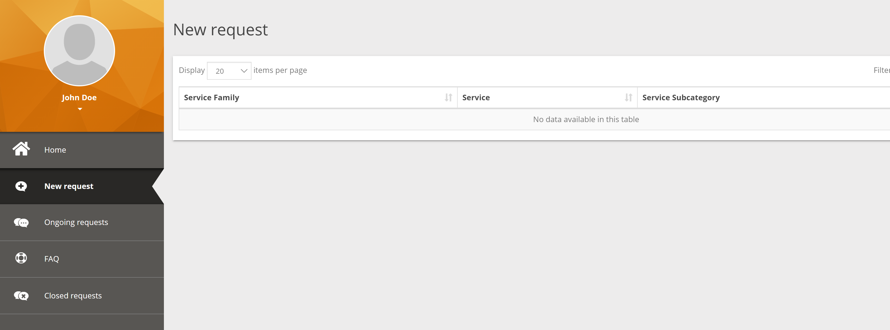

Posteriormente cómo queda el Portal de iTop para un cliente, tras la configuración de todos los elementos: Familia de Servicios, Servicios, Subcategoria de servicios, entre otros. Finalmente hemos decidido dar de alta 4 servicios en la aplicación: Adoptions, Pet Hotel Room, Booking y PetClinic4ClinicOwner que sería el principal y sobre el que vamos a crear las Incidencias y Peticiones solicitadas.

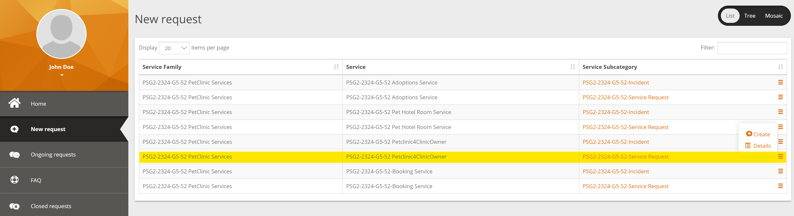

## Algunas capturas de pantalla sobre la Configuración de iTop

Captura de pantalla inicial de creación del Equipo (Team) de iTop asociado a los servicios de PetClinic para nuestra Organización.

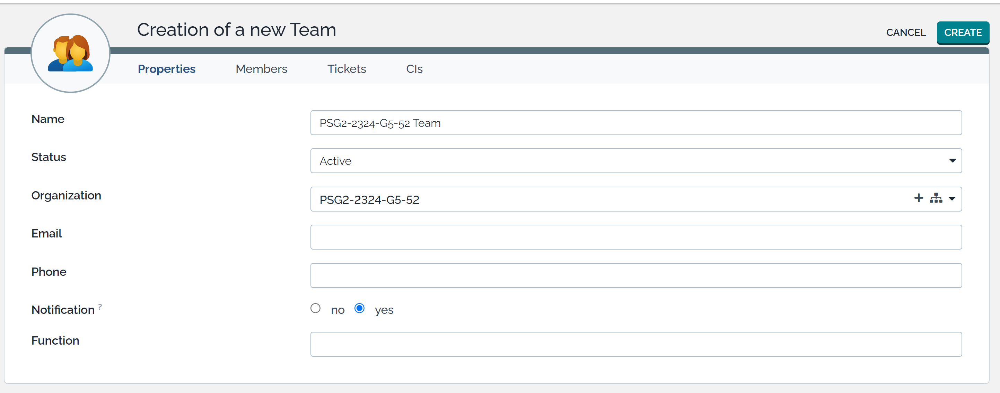

Confirmación de iTop del Equipo una vez creado, con sus datos correspondientes cumplimentados. (Team created)

A continuación se debe Editar el Equipo para realizar la asociación de miembros de la Organización al Equipo recién creado. La siguiente imagen muestra cómo queda el Equipo una vez asociados todos los miembros de nuestro grupo.

Como siguiente paso procedimos a realizar la asociación de CIs de la Organización al Equipo. La siguiente captura muestra ese proceso una vez completado. (Team updated)

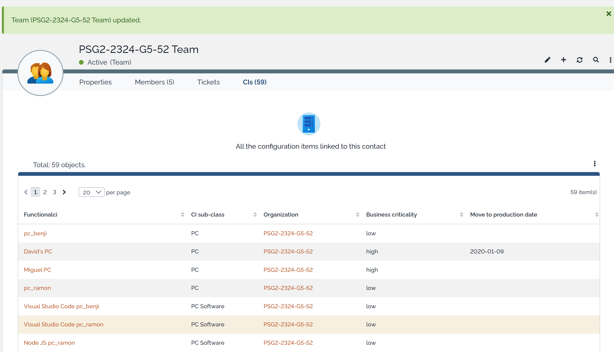

Lo siguiente que hicimos en cuanto a configuración de iTop fue la actualización de contraseñas de ambos clientes. La siguiente captura muestra el final (Saved) de dicha actualización para el cliente 2, Jane Doe.

Ambas contraseñas han sido establecidas a C0wn3r#1 y C0wn3r#2, respectivamente, para los clientes ClinicOwner1 (John Doe) y ClinicOwner2 (Jane Doe).

Algunas capturas de pantalla sobre la configuración final de iTop para la gestión de incidencias del Servicio PetClinic son las siguientes:

Relación de la creación de SLTs (Service Level Targets) para la métrica TTO ( Time to Own) del Plan Platinum.

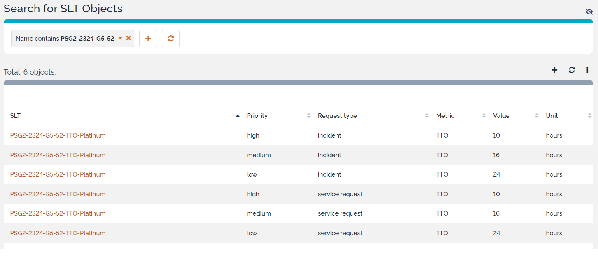

Captura del detalle de un SLT creado, TTO de prioridad High para el Plan Platinum, establecido en 10 horas. (SLT created)

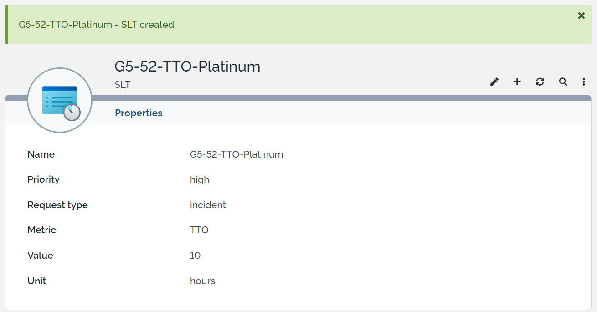

Como podemos apreciar en la imagen anterior sobre la relación de SLTs creados, se crearon un total de 6 SLTs para el Plan Platinum y la métrica TTO ( Time To Own), debido a que cada combinación de Plan-Métrica tiene a su vez dos tipos de Petición, Incidencia y Petición de Servicio/Usuario, donde cada una de ellas a su vez puede tener hasta tres Prioridades, Alta (High), Media (Medium) o Baja (Low).

Esos 6 SLTs mostrados en la imagen anterior corresponden por tanto a la combinación Plan PLATINUM-Métrica `TTO`, así que hubo que dar de alta otros 6 correspondientes a la combinación Plan PLATINUM-Métrica `TTR` (Time To Resolve) para dar cumplimiento y ser coherente con el Customer Agreement (CA) ofrecido a los clientes en la aplicación. Por tanto, un total de 12 SLTs por Plan.

Dado que la aplicación contempla 3 Planes de precios para clientes ( BASIC, GOLD y PLATINUM) el número final de SLTs dados de alta fue de 36, 12 por cada Plan.

Una vez creados los 36 SLTs se pudo pasar a la creación de los SLA (Service Level Agreement) de cada Plan y Servicio, y asociarles a continuación sus 12 SLTs correspondientes.

A continuación se muestra una captura de ejemplo de la creación del SLA del Servicio Adoptions para el Plan Basic. (SLA created)

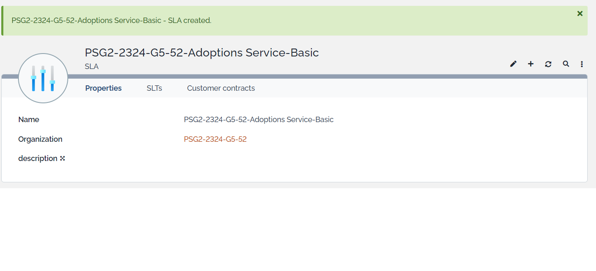

Posteriormente para que los clientes pudieran generar Incidencias y Peticiones de Usuario desde el Portal iTop se tuvo que crear la Familia de Servicios, y asociarle los Servicios y Subcategorías de servicio ofrecidos por PetClinic y dados de alta previamente en iTop. (Service Family created)

Llegados a este punto un cliente podría logarse en el Portal iTop y ver qué servicios asociados a su Contrato tendría disponibles para la creación de Incidencias o Peticiones de Servicio/Usuario. Como se mostró en la sección anterior sobre Portal iTop disponible para clientes, volvemos a mostrar cómo queda esa pantalla para el cliente ClinicOwner1, John Doe.

Una vez que un cliente ha creado sus Peticiones ( Incidencias o Peticiones de usuario) podría ver el estado de las mismas desde el Portal de iTop en la sección "Peticiones en curso" (Ongoing request), comprobando entre otras cosas su Estado, si está ya asignada a un miembro del equipo o está pendiente de asignación.

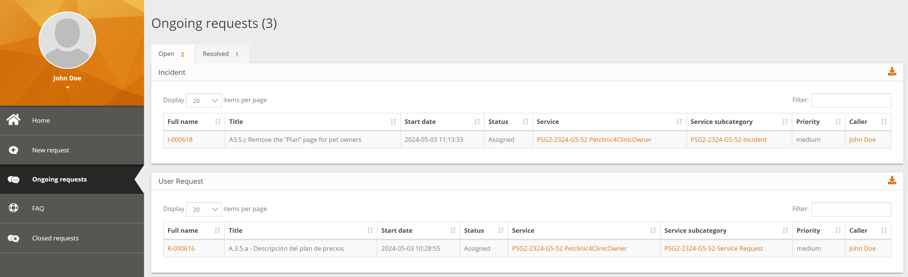

A su vez, los miembros del equipo de nuestra Organización, al logarse en iTop podrán comprobar la relación de Peticiones generadas por los clientes, así como su estado, si están asignadas o deber ser asignadas, si están resueltas, etc...

Esto sería un ejemplo de Petición de tipo Incidencia asignada, que vería un miembro del equipo de desarrollo.

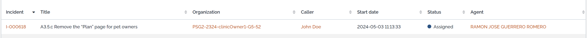

Y esto una captura de las Peticiones de tipo Petición de usuarios, ya una vez todas asignadas a miembros del equipo.

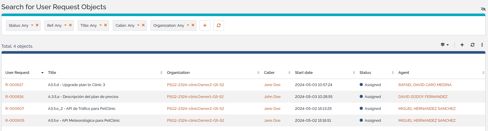

La siguiente captura muestra el detalle de una de esas Peticiones de usuario asignada a un miembro del equipo. (User Request updated)

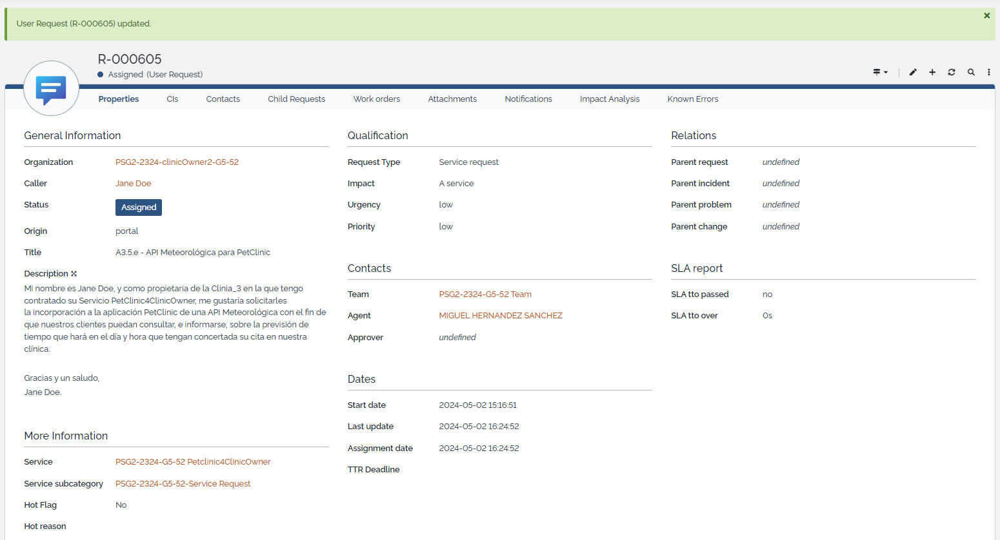

Cuando ya tenemos las peticiones asignadas a miembros, podríamos comprobar y calcular su métrica TTO (Time To Own), tiempo transcurrido desde que se crea la petición hasta que se asigna a un miembro del equipo de desarrollo, para determinar si hemos cumplido con lo acordado en el SLA del Customer Agreement para el Plan de precios contratado por el cliente, y el tipo de prioridad que nos han solicitado. Aquí podemos ver un ejemplo.

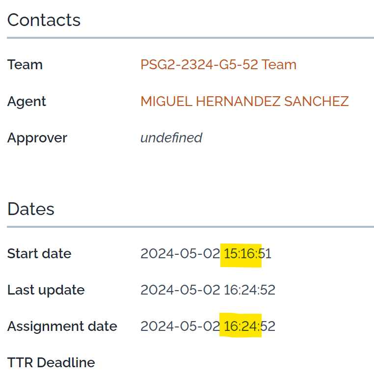

En este caso el TTO ha sido de 1 hora y 8 minutos, y estamos dentro del valor establecido para el SLA del cliente Jane Doe para su clínica 3, donde tiene contratado el Plan BASIC, que junto a la prioridad Low que ha indicado en su petición nos daba un TTO máximo de 56 horas.

Una vez una incidencia o petición de usuario ha sido resuelta, podríamos ver su estado y detalle como se muestra en el siguiente caso, en el que sólo faltaría cerra la petición desde iTop.

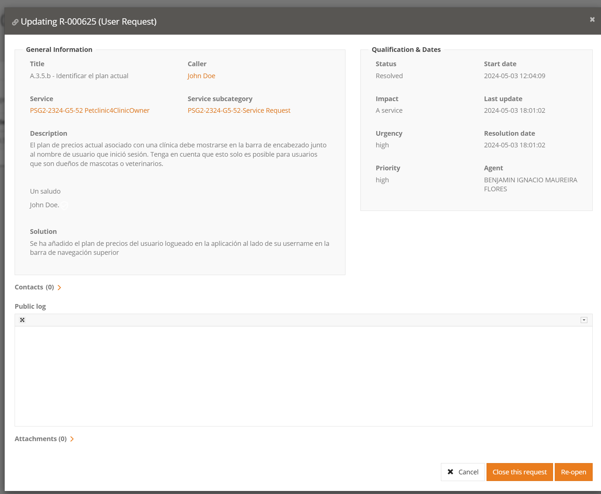

Es en este momento, cuando una petición queda marcada como resuelta en iTop, cuando podríamos ver su tiempo de métrica TTR (Time To Resolve) y comprobar, por tanto, si hemos cumplido o no con el SLA establecido para el cliente en su Plan de precios contratado, y para la prioridad de petición que nos hubieran solicitado en este caso.

## Dificultades encontradas durante la configuración de iTop

Una de las grandes dificultades encontradas ha sido que la web es muy poco intuitiva para el usuario, entonces para nuestra tarea a realizar, que era crear servicios, contratos, SLA y SLTs, que a priori suena como una tarea insignificante, nos ha llevado aproximadamente 2 horas. Además, de no ser por el documento proporcionado por los profesores, habría sido imposible llevar a cabo la tarea, ya que iTop no proporciona ningún tipo de guía o ayuda.

Por otro lado, hemos tenido que repetir muchas veces la gran parte de los pasos a seguir, por ejemplo, a la hora de crear los SLTs para asignarlos a los SLA, hemos tenido que ir creando uno por uno hasta un total de 12 SLTs por cada SLA, que al final se ha hecho muy mecánico y pesado. Hubiéramos agradecido que se pudiera hacer una creación en lotes o algo parecido.

Por último, lo más destacable ha sido a la hora de crear los Customer Contracts, que en lugar de crear un contrato para cada Clinic Owner con sus SLA correspondientes a los planes de precios, iTop sólo nos permite asignar un SLA a un contrato, por tanto hemos tenido que crear 3 contratos por cliente, para cada plan de precios.

## Funcionalidades que faltan en iTop para cubrir las tareas de este Sprint

## Contribuciones de cada miembro del grupo

| Miembro                          | Contribución                                                           |
| :------------                    | :-----------                                                           |
| Benjamín Ignacio Maureira Flores | Creación de servicios y subservicios: Adoptions, Pet Hotel Room, Booking, PetClinic4ClinicOwner. Booking service: creación de contratos, SLA y SLTs. |
| David Godoy Fernández            |Creación de los SLA para los diferentes planes al servicio Petclinic4ClinicOwner, creación de los diferentes contratos referentes al servicio. Posteriormente la  asociación de los contratos al servicio.            |  
| Miguel Hernández Sánchez         |                                                                        |
| Rafael David Caro Medina         | Creación del Equipo (Team) en iTop y asociación de miembros y CIs      |
| Rafael David Caro Medina         | Actualización de contraseñas para usuarios Cliente                     |
| Rafael David Caro Medina         | Creación de 12 SLTs (TTOs y TTRs) del Plan Platinum ( para Subcategorias Incidents y User Request, prioridades High, Medium y Low)                                                                             |
| Rafael David Caro Medina         | Creación de 3 SLAs del Service Adoptions ( para Planes Basic, Gold y Platinum) |
| Rafael David Caro Medina         | Asociación de sus 12 SLTS correspondientes a estos SLAs                     |
| Rafael David Caro Medina         | Configuración y asociación del servicio Adoptions a Contratos de clientes y SLAs   |
| Rafael David Caro Medina         | Creación del Service Family asociado a la Organización y Services necesario para la creación de incidencias desde iTop                     |
| Ramón José Guerrero Romero       | Creación de los TTO y TTR asociados a la categoría Gold. Luego la asociación de todos los planes referentes a PetHotelRoom de los SLA. Posteriormente la asociación de los contratos.|

