# Monitorización del Acuerdo de cliente de PetClinic Services (PSG2-2324-G5-52)

# Universidad de Sevilla   

## Escuela Técnica Superior de Ingeniería Informática

### **Grupo de Prácticas G5-52**
  
  

### Grado en Ingeniería Informática – Ingeniería del Software 

### Proceso Software y Gestión II
### Product Owner: Carlos Guillermo Müller Cejas
### Curso 2023 – 2024

### Miembros del equipo
- Benjamín Ignacio Maureira Flores
- David Godoy Fernández
- Miguel Hernández Sánchez
- Rafael David Caro Medina
- Ramón José Guerrero Romero

# Indice

- [Introducción](#introducción)
- [A3.5.a - Pricing plans description](#a35a---pricing-plans-description)
- [A3.5.b - Identify current plan task](#a35b---identify-current-plan-task)
- [A3.5.c - Remove the "Plan" page fot pet owners](#a35c---remove-the-plan-page-fot-pet-owners)
- [A3.5.d. - Upgrade plan to Clinic 3](#a35d---upgrade-plan-to-clinic-3)
- [A3.5.e1 - API-based extensions: API Weather for PetClinic](#a35e1---api-based-extensions-api-weather-for-petclinic)
- [A3.5.e2 - API-based extensions: API Traffic for PetClinic](#a35e2---api-based-extensions-api-traffic-for-petclinic)

# Introducción

En este informe resumiremos el trabajo realizado para monitorizar el Customer Agreement (CA en adelante) del servicio PetClinic. Para cada solicitud implementada en el punto A3.5 del Product Backlog (PB en adelante), realizaremos un pequeño estudio y análisis del grado de cumplimiento del SLT asociado, así como el tiempo transcurrido entre la creación de la tarea/issue en GitHub y su cierre. Utilizarremos capturas de pantalla de iTop y GitHub para mostrar cuándo se abrieron y cerraron dichas peticiones y tareas.

## A3.5.a - Pricing plans description

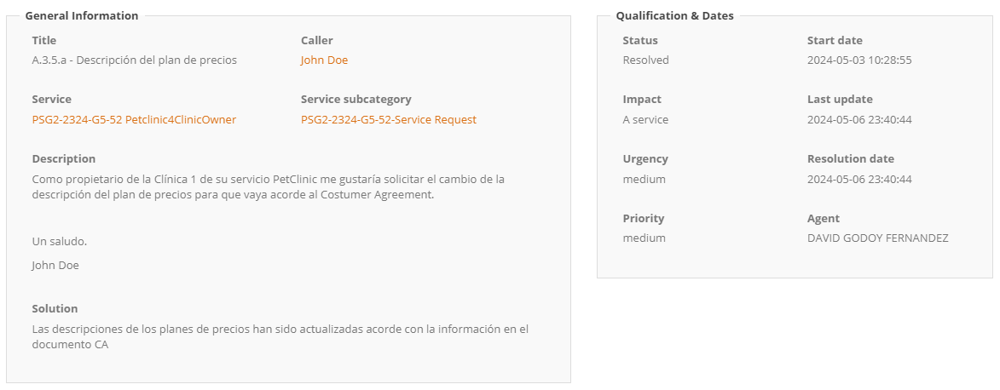

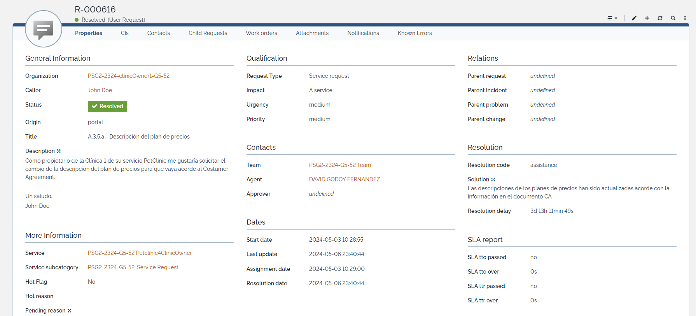

Como se puede ver en las capturas, la petición se abre en iTop el 3 de mayo a las 10:28 y se asigna a las 12:29, dando lugar a un TTO de 5 segundos, este tiempo tan pequeño se debe a que fue asignado por el creador de la request de forma automatica por error, dando lugar a un TTR de 72 horas.

Se cumple al 100% el SLT asociado, ya que la urgencia es media (hemos supuesto que es usuario basic) y la prioridad es media:
  - Nos daría un TTO objetivo de 32 horas y el TTO ha sido de 5 segundos.
  - Nos daría un TTR objetivo de 82 horas y el TTR ha sido de 72 horas.

Cabe destacar que la tarea habia sido ralizada antes de las 72 horas pero no ha sido marcada como resuelta hasta el dia 6 por lo que se ha decidido contemplar la hora de resolución de iTop.

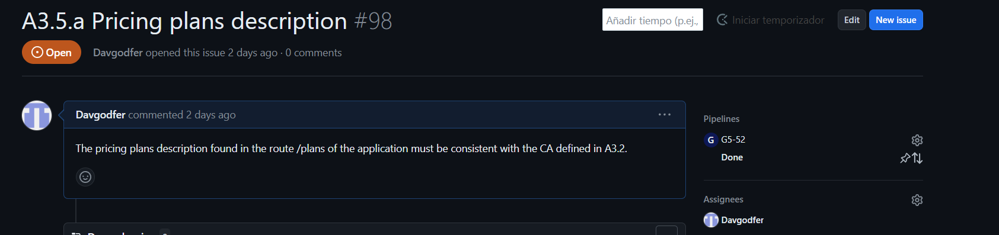

Como se puede ver, en Github se creó la issue el dia 4 de mayo, 24 horas después de asignarse.

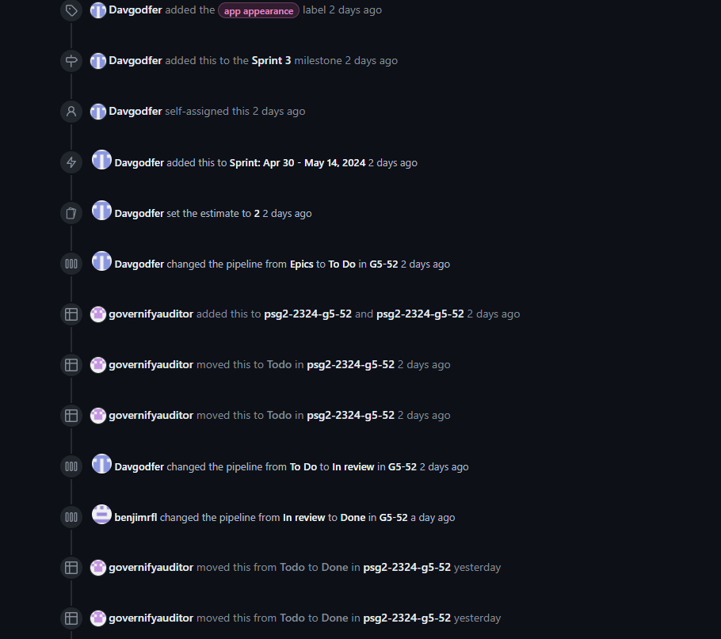

Entrando en más detalle, podemos ver que se movió a la pipeline de To Do inmediatamente y se procedió a su implementación, cabe destacar que se movio directamente a in review ya que la tarea se realizo muy rapidamente, momento en el que se marca como resuelta en iTop y se mueve a In Review con su respectiva pull request.

Tras la revisión del equipo, se hace merge de la rama a la rama de desarrollo, el despliegue de la nueva versión se realiza el domingo 5 de mayo por la mañana, momento en el que todas las issues se pasan a Done.

Tras este análisis se pueden sacar 2 conclusiones:
- Si para el TTR se tiene en cuenta el tiempo desde que se asigna hasta que se implementa la funcionalidad solicitada o se corrije un bug, entonces podemos decir que para esta tarea, el SLT se cumple al 100%, ya que transcurren 72 horas desde que se asigna hasta que se implementa.

- Si para el TTR se tiene en cuenta el tiempo desde que se asigna hasta que todo el equipo la aprueba y se despliegan los nuevos cambios, entonces el cumplimiento del SLT para el TTR sería del 100%, ya que transcurren 48 horas desde la asignación hasta el despliegue de los cambios, el TTO sería del 100% ya que sí se asignó en el tiempo acordado.

Por último, cabe destacar que el equipo ha acordado hacer el despliegue de la nueva versión cuando todos los cambios solicitados estuvieran correctamente implementados y revisados a través de las pull requests, cosa que ha retrasado bastante todos los tiempos.

## A3.5.b - Identify current plan task

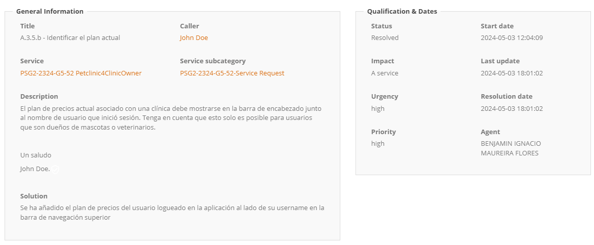

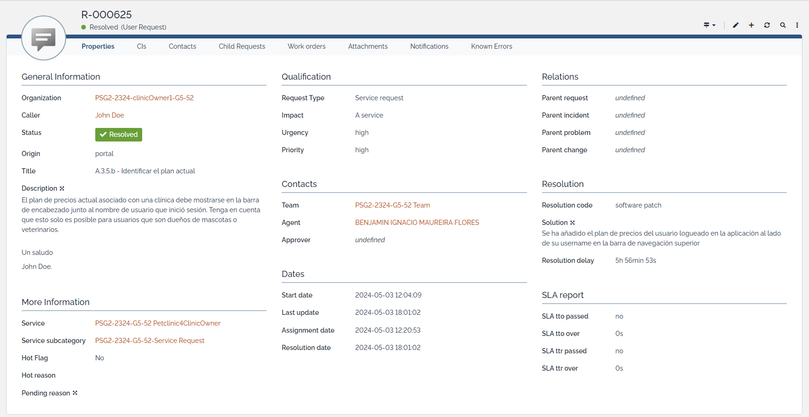

Como se puede ver en las capturas, la petición se abre en iTop el 3 de mayo a las 12:04 y se asigna a las 12:20, dando lugar a un TTO de 16 minutos, bastante rápido gracias a la comunicación del equipo de soporte y el poco volumen de incidencias y trabajo.
Además, se resolvió a las 18:01 del mismo día, dando lugar a un TTR de 5 horas y 56 minutos.

Se cumple al 100% el SLT asociado, ya que la urgencia es alta (hemos supuesto que es usuario Platinum) y la prioridad es alta:
  - Nos daría un TTO objetivo de 10 horas y el TTO ha sido de 16 minutos.
  - Nos daría un TTR objetivo de 24 horas y el TTR ha sido de 5 horas y 56 minutos.

Cabe destacar que se ha marcado como resuelta en iTop una vez estaba la funcionalidad implementada, a falta de la revisión del equipo y el merge a la rama de desarrollo y posterior despliegue.

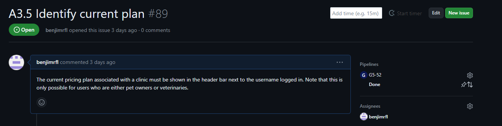

Como se puede ver, en Github se creó la issue a las 12:31 del 3 de mayo, 11 minutos después de asignarse.

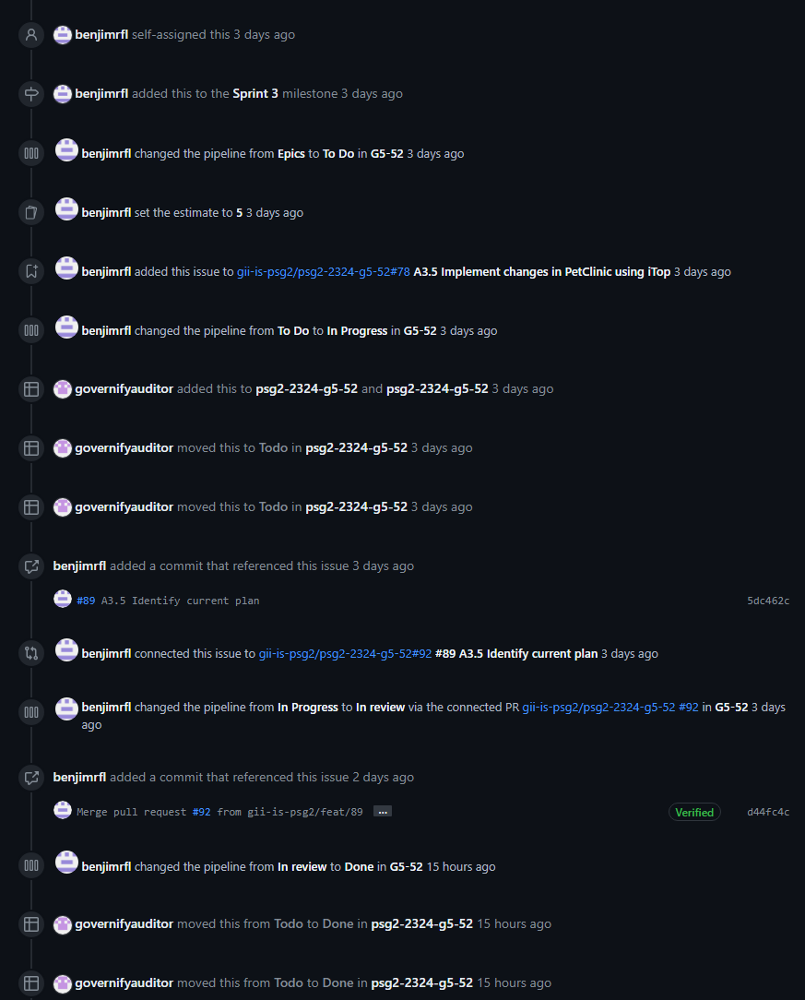

Entrando en más detalle, podemos ver que se movió a la pipeline de In Progress inmediatamente y se procedió a su implementación, dando lugar a un primer commit a las 18:01, momento en el que se marca como resuelta en iTop y se mueve a In Review con su respectiva pull request.

Tras la revisión del equipo, se hace merge de la rama a la rama de desarrollo el 4 de mayo a las 21:26 y el despliegue de la nueva versión se realiza el domingo 5 de mayo por la mañana, momento en el que todas las issues se pasan a Done.

Tras este análisis se pueden sacar 2 conclusiones:

- Si para el TTR se tiene en cuenta el tiempo desde que se asigna hasta que se implementa la funcionalidad solicitada o se corrije un bug, entonces podemos decir que para esta tarea, el SLT se cumple al 100%, ya que transcurren 5 horas y 56 minutos desde que se asigna hasta que se implementa.

- Si para el TTR se tiene en cuenta el tiempo desde que se asigna hasta que todo el equipo la aprueba y se despliegan los nuevos cambios, entonces el cumplimiento del SLT para el TTR sería del 0%, ya que transcurren más de 24 horas desde la asignación hasta el despliegue de los cambios, pero del TTO sería del 100% ya que sí se asignó en el tiempo acordado.

Por último, cabe destacar que el equipo ha acordado hacer el despliegue de la nueva versión cuando todos los cambios solicitados estuvieran correctamente implementados y revisados a través de las pull requests, cosa que ha retrasado bastante todos los tiempos.

## A3.5.c - Remove the "Plan" page fot pet owners

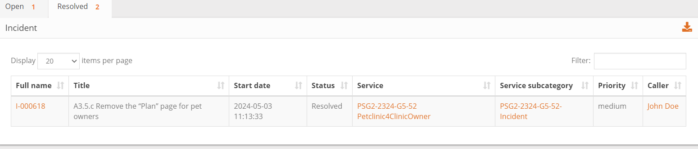

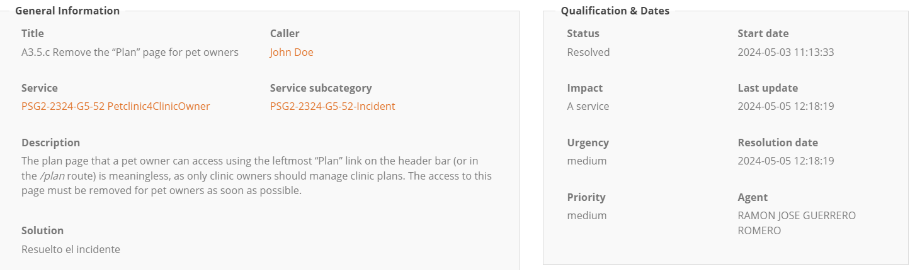

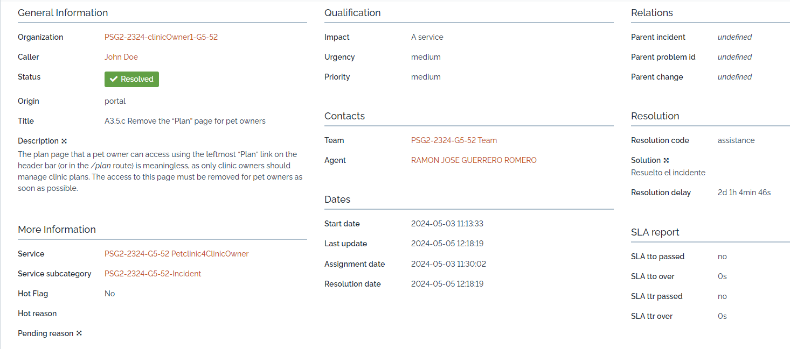

Como se puede ver en las capturas, la petición se abre en iTop el 3 de mayo a las 11:13 y se asigna a las 11:30, dando lugar a un TTO de 17 minutos, bastante rápido gracias a la comunicación del equipo de soporte y el poco volumen de incidencias y trabajo. Además, se resolvió a las 12:18 del día 05 de mayo, dando lugar a un TTR de 2 días, 1 hora y 48 minutos.

Se cumple al 100% el SLT asociado, ya que la urgencia es media (hemos supuesto que es usuario Gold) y la prioridad es media:
  - Nos daría un TTO objetivo de 24 horas y el TTO ha sido de 17 minutos.
  - Nos daría un TTR objetivo de 72 horas y el TTR ha sido de 2 días, 1 hora y 48 minutos.
  
Cabe destacar que se ha marcado como resuelta en iTop una vez estaba la funcionalidad implementada, a falta de la revisión del equipo y el merge a la rama de desarrollo y posterior despliegue.

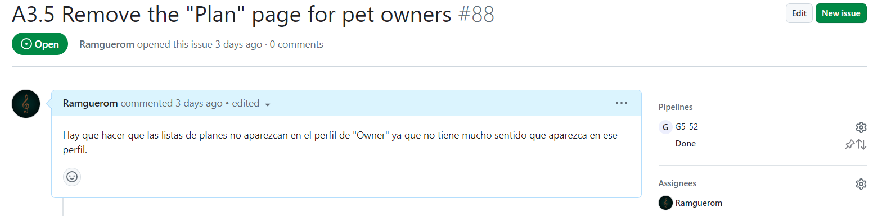

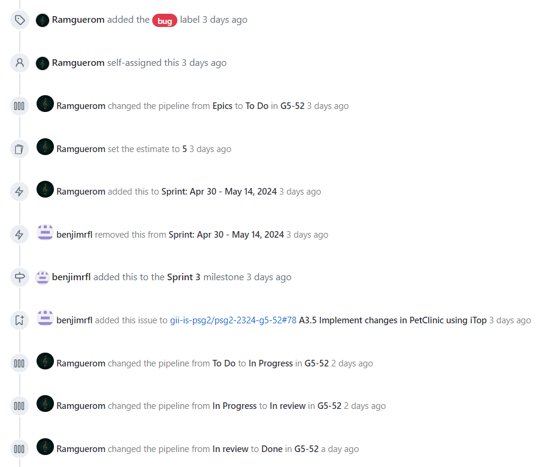

Tras la revisión del equipo, se hace merge de la rama a la rama de desarrollo (develop) y el despliegue de la nueva versión, cuando todas las issues se pasan a Done.

Tras este análisis se pueden sacar 2 conclusiones:

- Si para el TTR se tiene en cuenta el tiempo desde que se asigna hasta que se implementa la funcionalidad solicitada o se corrije un bug, entonces podemos decir que para esta tarea, el SLT se cumple al 100%, ya que transcurren 2 días, 1 hora y 48 minutos desde que se asigna hasta que se implementa.

- Si para el TTR se tiene en cuenta el tiempo desde que se asigna hasta que todo el equipo la aprueba y se despliegan los nuevos cambios, entonces el cumplimiento del SLT para el TTR sería del 0%, ya que transcurren más de 24 horas desde la asignación hasta el despliegue de los cambios, pero del TTO sería del 100% ya que sí se asignó en el tiempo acordado.

Por último, cabe destacar que el equipo ha acordado hacer el despliegue de la nueva versión cuando todos los cambios solicitados estuvieran correctamente implementados y revisados a través de las pull requests, cosa que ha retrasado bastante todos los tiempos.

## A3.5.d. - Upgrade plan to Clinic 3

En la siguiente captura de pantalla se muestra la petición de usuario R-000617, correspondiente a la tarea A3.5.d del PB, en la que se nos indica que la propietaria de la clínica 3, Jane Doe, quiere actualizar su plan asociado a esta clínica al inmediatamente superior. Y que nos aseguremos de que la actualización persiste una vez realizada.

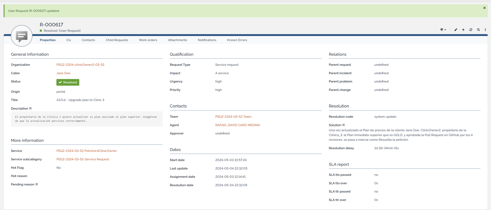

Podemos comprobar en la imagen que la petición se creó en iTop el 03 de Mayo de 2024 a las 10:57, y que se asigna al técnico correspondiente a las 12:14 del mismo día, es decir, 1 hora y 17 minutos después, con lo cual éste sería el valor TTO para esta petición.

Un TTO de 1 hora y 17 minutos está dentro del SLT establecido para el Plan BASIC que tiene contratado la cliente para su clínica 3, y para una prioridad asignada Alta, que nos daba un valor máximo de tiempo o valor objetivo de 14 horas según se especifica en el CA, con lo cual, se ha cumplido el SLA para esta petición en cuanto a métrica TTO.

Asímismo, se puede comprobar que la fecha y hora de resolución de la petición fue el día 04 de mayo a las 22:32, dando un tiempo de resolucón o TTR de 1 día, 11 horas 24 minutos, debido a retrasos en la revisión y aprobación de la Pull Request asociada en GitHub. Aún así, el TTR conseguido está dentro de los límites del valor objetivo especificado en el SLA del CA, que es un valor de 56 horas para el Plan BASIC de la cliente y una prioridad Alta.

Por tanto, podemos concluir que se han cumplido ambas métricas, TTO y TTR, para esta petición de usuario R-000617.

## A3.5.e1 - API-based extensions: API Weather for PetClinic

Como se puede ver en las capturas, la petición se abre en iTop el 2 de mayo a las 15:16 y se asigna a las 16:24, dando lugar a un TTO de 1 hora y 8 minutos, bastante rápido gracias a la comunicación del equipo de soporte y el poco volumen de incidencias y trabajo. Además, se resolvió a las 11:39 del día 5 de mayo, dando lugar a un TTR de 68h.

Se cumple totalmente el SLT asociado, ya que la urgencia es baja al ser el usuario BASIC y la prioridad es baja al ser una nueva funcionalidad que no afecta considerablemente a la plataforma:

- Nos daría un TTO objetivo de 52 horas y el TTO ha sido de 1 horas y 8 minutos.
- Nos daría un TTR objetivo de 104 horas y el TTO ha sido de 68 horas.

Cabe destacar que se ha marcado como resuelta en iTop una vez estaba la funcionalidad revisada por el equipo y mergeada a la rama de desarrollo a falta del posterior despliegue.

Como se puede ver, en GitHub se creó la issue el mismo día en la que fue asignada la incidencia en iTop.

Entrando en más detalle, podemos ver que se movió a la pipeline de To Do inmediatamente y se procedió a su implementación. Más tarde se pasó la tarea a Done.

Tras este análisis se pueden sacar 2 conclusiones:

- Si para el TTR se tiene en cuenta el tiempo desde que se asigna hasta que se implementa la funcionalidad solicitada o se corrije un bug, entonces podemos decir que para esta tarea, el SLT se cumple al 100%, ya que transcurre menos de un día.

- Si para el TTR se tiene en cuenta el tiempo desde que se asigna hasta que todo el equipo la aprueba y se despliegan los nuevos cambios, entonces el cumplimiento del SLT para el TTR sería del 100% en este caso, ya que transcurren 68 horas desde la asignación hasta el despliegue de los cambios.

## A3.5.e2 - API-based extensions: API Traffic for PetClinic

Como se puede ver en las capturas, la petición se abre en iTop el 2 de mayo a las 16:13 y se asigna a las 16:26, dando lugar a un TTO de 13 minutos, bastante rápido gracias a la comunicación del equipo de soporte y el poco volumen de incidencias y trabajo. Además, se resolvió a las 11:37 del día 5 de mayo, dando lugar a un TTR de 68h.

Se cumple totalmente el SLT asociado, ya que la urgencia es baja al ser el usuario BASIC y la prioridad es baja al ser una nueva funcionalidad que no afecta considerablemente a la plataforma:

- Nos daría un TTO objetivo de 52 horas y el TTO ha sido de 13 minutos.
- Nos daría un TTR objetivo de 104 horas y el TTO ha sido de 68 horas.

Cabe destacar que se ha marcado como resuelta en iTop una vez estaba la funcionalidad revisada por el equipo y mergeada a la rama de desarrollo a falta del posterior despliegue.

Como se puede ver, en GitHub se creó la issue el mismo día en la que fue asignada la incidencia en iTop.

En este caso no se conectó a tiempo la pull request a la issue de Zenhub y no se muestran los datos de cuando se movió entre las diferentes columnas.

Tras este análisis se pueden sacar 2 conclusiones:

- Si para el TTR se tiene en cuenta el tiempo desde que se asigna hasta que se implementa la funcionalidad solicitada o se corrije un bug, entonces podemos decir que para esta tarea, el SLT se cumple al 100%, ya que transcurre menos de un día.

- Si para el TTR se tiene en cuenta el tiempo desde que se asigna hasta que todo el equipo la aprueba y se despliegan los nuevos cambios, entonces el cumplimiento del SLT para el TTR sería del 100% en este caso, ya que transcurren 68 horas desde la asignación hasta el despliegue de los cambios.