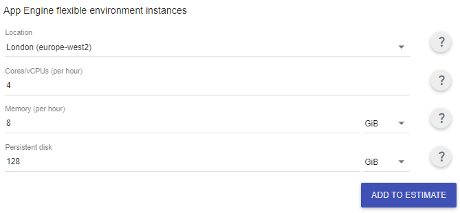
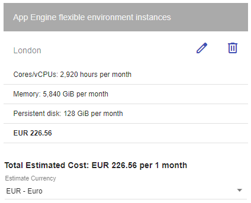

# Análisis de la capacidad y el riesgo de PetClinic Services (PSG2-2324-g5-52)

# Universidad de Sevilla   

## Escuela Técnica Superior de Ingeniería Informática

### **Grupo de Prácticas G5-52**
  
  

### Grado en Ingeniería Informática – Ingeniería del Software 

#### Proceso Software y Gestión II
### Product Owner: Carlos Guillermo Müller Cejas
### Curso 2023 – 2024

### Miembros del equipo
- Benjamín Ignacio Maureira Flores
- David Godoy Fernández
- Miguel Hernández Sánchez
- Rafael David Caro Medina
- Ramón José Guerrero Romero

## TCO

### CapEx: es el coste de adquirir, mantener o mejorar activos fijos.

| Item | Descripción | Coste en euros/periodos | Numero de periodos | Total en euros |
|------|-------------|-------------------------|--------------------|----------------|
| 1    | Licencias de sistemas operativo (Windows 11) | 145,00/año | 1 | 145,00 x 5 = 725,00 |
| 2    | Técnico de configuración del servidor | 300,00/técnico | 1 | 300,00 |
| 3    | Equipo hardware (5 personas) | 1250,00/desarrollador | 24 | 1250,00 x 5 = 6250,00 |
|      |    |    | Total | 7275,00 |

Se establece como 0 las licencias software dado que se usan los servicios que utilizamos o sólo disponen de una versión gratuita o el plan usado durante el desarrollo es el gratuito. Esto se refiere a las herramientas de Clockify, ZenHub, SonarQube, entre otros. Además hemos supuesto que el equipo de desarrollo trabajará en la ETSII, por lo que los gastos adheridos a oficinas, luz, internet, etc, no se tendrán en cuenta.

### OpEx: es el coste permanente del "día a día" de la empresa para su correcto funcionamiento.

| Item | Descripción | Coste en euros/periodos | Numero de periodos | Total en euros |
|------|-------------|-------------------------|--------------------|----------------|
| 1    | Salarios (*)(**) | 8800 | 24 | 211200,00 |
| 2    | Equipo Soporte x 2 | 1600,00/mes | 24 | 1600,00 x 24 = 38400,00 |
| 2    | Gastos de transporte a la sede (ETSII) | 30,00/miembro: 30x5 = 150 (***) | 24 | 3600,00 |
| 3    | Alojamiento de la aplicación en la nube | 226,56 | 24 | 5.437,44 |
| 4    | Licencias GitHub Team | 3,67 x 5/mes | 24 | 435,00 |
| 4    | Licencias GitHub Copilot | 19 x 5/mes | 24 | 2280,00 |
| 5    | API meteorológica | 30,00/mes | 24 | 720,00 |
| 6    | API trafico | 130,00/mes | 24 | 3120,00 |
|      |    |    | Total | 265192,44 |

##### (*)Tabla auxiliar para los salarios según rol:

| Item | Rol | Coste en euros/hora | Numero de horas al mes | Total en euros/mes |
|------|-------------|-------------------------|--------------------|----------------|
| 1    |Scrum Master | 30,00/h | 80 | 2400,00|
| 2    |Desarrollador | 20,00/h | 80 | 1600,00 x 4 = 6400,00 |
|      |    |    | Total | 8800,00 |

##### (**)El gasto en el salario anual total sería de: 105600€ y puede variar entre un 0.5 %(+-528,00) y 3%(+-3168).

##### (***)El precio está calculado haciendo un promedio del precio de la gasolina en un mes y estando todo el equipo a unos 20 km de distancia de la empresa.

### Resumen de precios
El TCO durante 24 meses es de 272467,44€, con un CapEx de 7275,00€ y un OpEx de 265192,44€. 

## Análisis de capacidad del servicio extendido de PetClinic

A la hora del despliegue de nuestra aplicación hemos tenido en cuenta la capacidad objetivo dada en el product backlog, de 18000 usuarios y hemos supuesto que no son concurrentes, cosa que haría que se nos vaya mcho el precio al tener que contratar una o varias maquinas más potentes para garantizar el acceso de todos los usuarios al mismo tiempo.

Por tanto, a la hora de calcular el precio que supondrá el despliegue de la aplicación, hemos establecido el uso de las instancias a 4 cores y 8GB de memoria, que creemos que será más que suficiente para satisfacer la entrada de hasta 2000 usuarios concurrentes como máximo. 

Con respecto a las API, hemos tenido que seleccionar planes de precio para poder satisfacer las llamadas que se harán teniendo en cuenta que nuestra aplicación debe dar soporte a 18000 usuarios.

Para la API de tráfico, Semrush, hemos escogido el plan PRO, que nos permite obtener 3000 reportes de trafico al día, donde een cada reporte se podría obtener los datos de tráfico de un día y almacenarlo, para que cada vez que un usuario tenga que mostrar dicha información, se busque primero si está almacenada, y si no, se haga la llamada a la API, con el objetivo darle un buen uso al plan.

Para la API meteorológica, Meteostat API, hemos escogido el plan Ultra, que nos permite hacer 35000 peticiones al mes, más que suficiente para la capacidad que suponemos de 18000 usuarios.

## Análisis de los riesgos de operación y mantenimiento

En esta sección haremos un análisis detallado sobre los riesgos de operación y mantenimiento por el servicio incluido en el acuerdo con el cliente, tomando en consideración las condiciones descritas en las estimaciones del TCO, que el coste de las APIs cada 6 meses puede variar entre un 2% y 10%, y que el coste de los servicios usados por el nuestro pueden variar entre un 2% y 10%.

#### Google Cloud
Los riesgos relacionados con la operación y el mantenimiento en Google Cloud abarcan varios aspectos críticos. Por un lado, los cambios en las tarifas de los servicios en la nube pueden tener un impacto considerable en el presupuesto asignado para el mantenimiento, ya que incluso fluctuaciones modestas del 2 al 10% pueden afectar directamente el Costo Total de Propiedad (TCO) del servicio.

Además, la disponibilidad continua de los servicios de Google Cloud es fundamental para garantizar la operatividad sin interrupciones. Cualquier incidencia no planificada o problema de rendimiento en la infraestructura de Google Cloud podría resultar en períodos de inactividad y afectar la experiencia de los usuarios finales.

Por otro lado, la seguridad de los datos y el cumplimiento de las normativas son preocupaciones esenciales en cualquier servicio en la nube. La ocurrencia de brechas de seguridad o el incumplimiento de regulaciones puede acarrear consecuencias legales y financieras significativas, además de perjudicar la reputación del servicio.

#### GitHub
GitHub puede cambiar sus políticas y precios en cualquier momento. Estos cambios pueden afectar los costos asociados con el uso de la plataforma para el desarrollo y el control de versiones del software. Es importante estar al tanto de estas actualizaciones para gestionar eficazmente los recursos y costos del proyecto.
Las interrupciones o caídas del servicio dado por GitHub pueden afectar en la productividad y el mantenimiento del servicio, ya que nos retrasaría en el desarrollo de nuevas versiones y arreglos de bugs.

#### APIs externas
El uso de APIs externas nos supondría un riesgo ya que su precio puede aumentar, tendríamos que estar al tanto de las actualizaciones para modificar los planes de precio de nuestra aplicación en consecuencia.

#### Sueldos
Los cambios en los sueldos pueden tener un impacto directo en los costos operativos. Por ejemplo, si los sueldos aumentan en un rango del 6 al 10% de su valor actual, pasando de 1600 a 1760 euros, el costo total de operaciones se elevaría de 1.986,86 euros a 2.146,86 euros por un período de 24 meses, totalizando 17.174,88 euros.

Este aumento mensual de 100 euros, considerando el análisis de los 18.000 usuarios, podría tener un impacto en los planes, que tendrían que ajustar sus precios para cubrir los costes añadidos.

### Estimación de los planes de precio
Teniendo en cuenta que tenemos un TCO de 272467,44€ y queremos obtener un beneficio del 10%, es decir, obtener unos ingresos de 299714,18€

Suponiendo que le damos servicio al 50% de las clínicas veterinarias en Andalucía (1219), tendríamos 610 clínicas con 30 usuarios por cada una para llegar al objetivo de dar soporte a 18000 usuarios (realmente daríamos soporte a 18300 usuarios)

| Plan de precio | Clinicas | Precio/mes | Total en euros/24 meses |
|-------------------|-------------------------|--------------------|----------------|
| Platinum | 109 | 50€ | 50x109x24 = 130800€ |
| Gold     | 167 | 30€ | 30x167x24 = 120240€ |
| Basic    | 334 | 15€ | 15x334x24 = 120240€ |

Con estos planes de precio, obtendríamos ingresos de 371280€, que cubren los gastos realizados y nos da un beneficio mayor al 10%.
